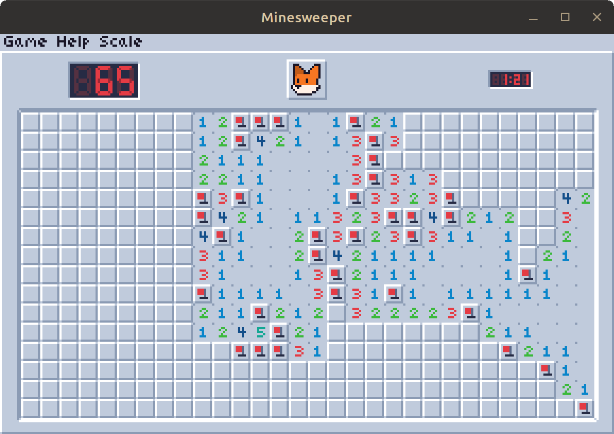

# Minesweeper

This is a little minesweeper game that I've been working on, written in Rust using the [Macroquad](https://github.com/not-fl3/macroquad) framework.

It's built on top of my own implementation of an immediate-mode GUI. It doesn't cache anything and isn't the most efficient, but it works very well for my purposes. Casey Muratori's [talk on this](https://youtu.be/Z1qyvQsjK5Y) was invaluable

## Credits:

Macroquad - [not-fl3](https://github.com/not-fl3/macroquad)
WASM build script ([build_wasm.sh](build_wasm.sh)) - [Tom Solberg (and more!)](https://gist.github.com/nicolas-sabbatini/8af10dddc96be76d2bf24fc671131add)
Explosion sound - [AyeDrevis](https://freesound.org/people/AyaDrevis/sounds/649191/)
Lowercase character 'e' - [04b03](https://www.dafont.com/04b-03.font)

Everything else made by me :3